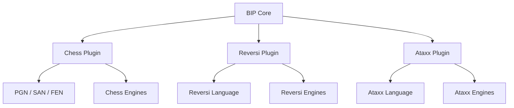

# BIP Artifact Library

*Archived 2026-10-09: superseded, Mentes moved to its own repository
(tag `mentes-final`).*

## Architecture and Product Design

| File | Description | Status |
|---|---|---|
| `bip-initial-architecture-v1.md` | Initial BIP architecture proposal. Defines BIP as a multiplatform Board Intelligence Platform, the game-plugin model, separation between BIP Core and game semantics, preservation of game-specific languages such as PGN/PDN/SGF, initial Chess/Reversi/Ataxx strategy, and the relationship between BIP and the former CHIP direction. | Current |

## Current Architectural Decisions

- BIP replaces CHIP as the starting architectural direction.
- BIP Core is game-independent.
- Games are implemented through plugins.
- Initial games are Chess, Reversi, and Ataxx.
- Reversi and Ataxx serve as inexpensive tests of the generic game abstraction.
- Chess is the complex initial game.
- Game-specific semantics belong in plugins.
- Game-specific engines belong in plugins.
- BIP does not define a universal replacement for established game notations.
- Each plugin owns its game language or languages.
- Chess preserves PGN, SAN, and FEN.
- Future draughts/checkers support should preserve PDN.
- Future Go support should preserve SGF.
- Human-readable established formats are first-class interfaces, not merely legacy import/export formats.
- Generic abstractions should emerge from concrete games rather than hypothetical requirements.
- When uncertain whether functionality belongs in BIP Core or a plugin, keep it in the plugin until multiple games demonstrate that it is genuinely generic.
- Target platforms remain Desktop, Web, and Android.
- Intelligence is an extension of the platform rather than a prerequisite for the initial architecture.

## Architectural Overview

## Relationship to CHIP

CHIP is no longer required as an architectural precursor to BIP.

The functionality previously envisioned for CHIP becomes the chess implementation of BIP.

If the CHIP name is retained later, it may represent a chess-specific distribution or product branding built on BIP rather than a separate platform implementation.

## Library Maintenance

When a BIP design document is superseded:

1. Add the new version to this library.
2. Mark the previous version as superseded.
3. Keep the historical entry rather than silently replacing it.
4. Update the **Current Architectural Decisions** section when a decision changes.
5. Prefer versioned filenames for substantial architectural revisions.
